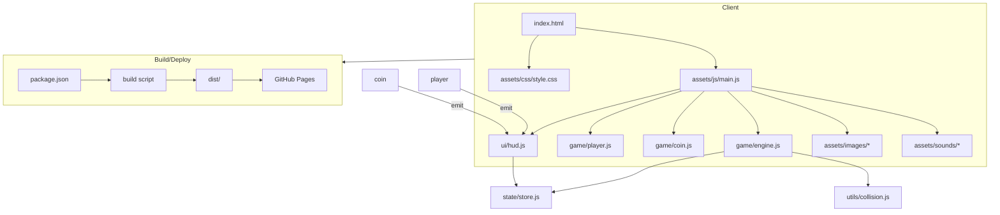

# MyTest_Coin_Game

GitHub Pages 網址: https://telearnstudent8-cyber.github.io/MyTest_Coin_Game/

簡介
----
MyTest_Coin_Game 是一個以瀏覽器為主的簡單投幣/撿取幣遊戲範例（Coin Game）。本 README 以繁體中文撰寫，包含專案說明、���構圖（使用 mermaid）以及基本的建置與開發指引。

我已載入 repository-code-search 能力並嘗試讀取您的倉庫樹狀，但目前讀取倉庫樹的 API 未返回內容。因此我先根據常見的靜態前端遊戲專案結構草擬此 README。如果您願意貼上專案的檔案列表或授權我再次存取倉庫內容，我會把 README 調整為與實際檔案一致的版本。

專案目標
--------
- 提供一個小型的教學/示範用遊戲範例（用於學習前端互動、遊戲 loop、碰撞檢測等）。
- 可直接部署至 GitHub Pages 作為靜態網站。

程式架構（概念性說明）
--------------------
下方使用 mermaid 流程圖說明典型的專案模組與互動（請依實際專案檔案對照）：

圖說（說明每個模組）
- index.html：程式進入點，載入必要的 CSS/JS。
- assets/css/style.css：樣式檔（畫面佈局、遊戲畫布尺寸等）。
- assets/js/main.js：初始化與遊戲 loop 控制。
- game/engine.js：遊戲引擎（時間步進、更新/繪製呼叫）。
- game/player.js：玩家邏輯（輸入處理、移動）。
- game/coin.js：金幣物件（生成、碰撞判斷、消失邏輯）。
- ui/hud.js：分數、生命等 UI 顯示。
- state/store.js：遊戲狀態管理（分數、關卡、暫停等）。
- utils/collision.js：碰撞相關工具函式。
- assets/images、assets/sounds：遊戲資源（圖片與音效）。
- package.json、build scripts：如果使用打包或工具（例如 webpack、vite 或 parcel），則在此處定義建置與部署流程。
- dist/：打包輸出，供 GitHub Pages 部署使用。

推薦資料夾（範例）
----------------
以下為常見靜態遊戲專案的範例目錄（請依您的專案實際結構調整）：

- index.html
- README.md
- assets/
  - css/
    - style.css
  - js/
    - main.js
    - game/
      - engine.js
      - player.js
      - coin.js
    - ui/
      - hud.js
    - state/
      - store.js
    - utils/
      - collision.js
  - images/
  - sounds/
- package.json (選用)
- dist/ (build 輸出)

快速開始（使用者）
------------------
1. 若為純靜態檔案（沒有 node/打包需求）
   - 直接開啟 `index.html`（或使用本機靜態伺服器如 Live Server 或 Python 的 `python -m http.server`）。
2. 若專案包含 package.json（Node.js）
   - 安裝依賴：`npm install`
   - 啟動開發伺服器（視專案設定）：`npm start` 或 `npm run dev`
   - 建置生產檔案：`npm run build`
   - 把 build 輸出（常見為 `dist/` 或 `build/`）部署到 GitHub Pages（以 gh-pages 分支或 GitHub Actions 自動部署）

在 GitHub Pages 上部署（簡要）
--------------------------
- 方法一（最簡）：如果 repository 的根目錄或 gh-pages 分支包含靜態檔案，並在 GitHub Pages 設定中選擇對應分支即可。
- 方法二（自動化）：使用 GitHub Actions 腳本在每次 push 時自動 build 並部署到 GitHub Pages。
- 網址（此專案）：https://telearnstudent8-cyber.github.io/MyTest_Coin_Game/

開發者說明（建議）
------------------
- 建議把遊戲邏輯與 DOM/UI 分離（Engine vs UI），便於測試與維護。
- 使用小的模組（例如 player、coin、collision、state）提高可讀性與可測試性。
- 若需支援多解析度或響應式畫布，請在 engine 中實作縮放/重繪邏輯。
- 若加入第三方套件（例如 Phaser、Howler），請在 README 中補上安裝與設定說明。

常見問題（FAQ）
----------------
Q: 如何新增關卡或提高難度？
A: 在 state 或 game/engine 中新增關卡配置（例如出現金幣速率、敵人數量、速度等），並在每回合更新參數。

Q: 如何調整畫布大小與縮放？
A: 在 main.js 或 engine.js 攔截視窗 resize 事件，重算畫布寬高並依比例縮放遊戲座標。

想要我做什麼接下來？
--------------------
我已先產出這份 README 範本。如果您希望我直接把 README 提交到倉庫（建立/更新檔案），或希望我依據實際檔案自動產生更精確的內容，請：
- 授權我讀取該 repo 的檔案（或提供檔案列表），或者
- 貼上您想要我引用的專案關鍵檔案（例如 package.json、index.html 或主要 JS 檔案）。

授權或提供檔案後，我會：
- 讀取專案結構並更新 README 中的檔案清單與啟動指令，
- 調整 mermaid 圖以反映實際模組關係，
- 並可協助建立 GitHub Pages 的自動部署設定（例如提供範例 GitHub Actions workflow）。
  
貢獻
----
歡迎提出 issue 或 PR，描述您想新增或改進的功能。

License
-------
請在此填入授權條款（例如 MIT、Apache-2.0），若不確定請告知我您希望的授權類型，我可以幫您生成 LICENSE 檔案。

聯絡
----
若有問題請在 repository 建立 issue，或直接在 README 下方留下聯絡資訊。
